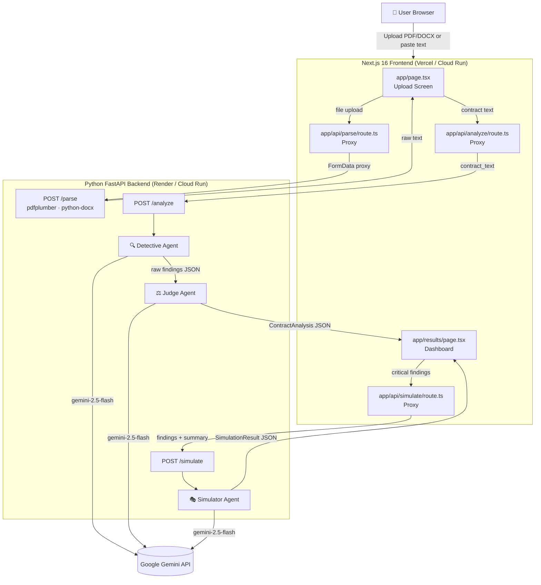

# LexGuard — System Architecture

## Overview

LexGuard is an **adversarial multi-agent AI system** for contract intelligence. Three Gemini 2.5 Flash agents work in sequence: a Detective that hunts exploitative clauses, a Judge that verifies and scores every finding, and a Simulator that generates worst-case consequence stories.

Most contract analysis tools use a single summarization prompt. LexGuard's adversarial design — two agents arguing about the same document — catches edge cases that a single pass misses and produces significantly more accurate risk ratings.

---

## System Diagram



---

## Agent Design

### Agent 1 — Detective (`backend/detective.py`)

| Property | Value |
|---|---|
| Model | `gemini-2.5-flash` |
| Role | Adversarial clause hunter |
| Input | Raw contract text (≤20k chars) |
| Output | `Finding[]` — partial objects, no verdict/score yet |
| Temperature | 0.1 (deterministic, schema-consistent) |
| Max output tokens | 4096 |

Scans the full document for every clause that could harm the signing party. Classifies into 13 risk categories. Returns a raw JSON array — fields like `judge_verdict`, `recommendation`, and `negotiation_tip` are intentionally left empty for the Judge to fill.

### Agent 2 — Judge (`backend/judge.py`)

| Property | Value |
|---|---|
| Model | `gemini-2.5-flash` |
| Role | Adversarial verifier |
| Input | Contract text + Detective's raw findings |
| Output | Full `ContractAnalysis` — enriched findings, risk score, document summary |
| Temperature | 0.1 |
| Max output tokens | 8192 |

Reviews each Detective finding **independently** against the source document. Confirms, upgrades, downgrades, or dismisses each one. Computes the overall risk score using the formula below and generates plain-English impact statements and negotiation tips.

**Risk scoring formula:**
```
overall_risk_score = min(CRITICAL×25 + HIGH×10 + MEDIUM×5 + LOW×1, 100)
```

| Score | Level |
|---|---|
| 0–19 | SAFE |
| 20–39 | LOW |
| 40–59 | MEDIUM |
| 60–79 | HIGH |
| 80–100 | CRITICAL |

### Agent 3 — Simulator (`backend/simulate.py`)

| Property | Value |
|---|---|
| Model | `gemini-2.5-flash` |
| Role | Consequence narrator |
| Input | CRITICAL + HIGH findings + contract summary |
| Output | `SimulationResult` — worst-case story, financial risk, per-clause scenarios |
| Temperature | 0.7 (narrative, creative) |
| Max output tokens | 2048 |

Generates vivid second-person worst-case stories for each high-risk clause. Triggered on demand via the "Simulate Worst-Case Scenario" button on the results page.

---

## API Endpoints

### Python FastAPI Backend

| Method | Path | Input | Output |
|---|---|---|---|
| GET | `/health` | — | `{status, service}` |
| POST | `/parse` | `multipart/form-data: file` | `{text: string}` |
| POST | `/analyze` | `{contract_text: string}` | `ContractAnalysis` |
| POST | `/simulate` | `{findings, contract_summary}` | `SimulationResult` |

### Next.js API Proxies

| Route | Proxies to | Transformation |
|---|---|---|
| `POST /api/parse` | `BACKEND_URL/parse` | Pass-through FormData |
| `POST /api/analyze` | `BACKEND_URL/analyze` | `contractText` → `contract_text` |
| `POST /api/simulate` | `BACKEND_URL/simulate` | Pass-through JSON |

---

## Data Schema

```typescript
// Core types (types/analysis.ts)

interface ContractAnalysis {
  document_type: "CONTRACT" | "OFFER_LETTER" | "NDA" | "TERMS_OF_SERVICE" | "PRIVACY_POLICY" | "OTHER";
  contract_summary: string;
  overall_risk_score: number;       // 0–100
  risk_level: "SAFE" | "LOW" | "MEDIUM" | "HIGH" | "CRITICAL";
  summary_stats: {
    total_findings: number;
    critical_count: number;
    high_count: number;
    medium_count: number;
    low_count: number;
    false_positives_removed: number;
  };
  analysis_metadata: {
    judge_confidence: number;       // 0.0–1.0
    analysis_timestamp: string;     // ISO 8601
  };
  findings: Finding[];
}

interface Finding {
  id: string;
  clause_text: string;              // verbatim quote, max 300 chars
  clause_location: string;          // e.g. "Section 3.2"
  category: ClauseCategory;
  severity: "CRITICAL" | "HIGH" | "MEDIUM" | "LOW";
  title: string;
  detective_finding: string;        // Agent 1's analysis
  judge_verdict: string;            // Agent 2's ruling
  plain_english_impact: string;     // What could happen to the user
  recommendation: "ACCEPT" | "NEGOTIATE" | "REJECT";
  negotiation_tip: string;
  verified: boolean;
  false_positive: boolean;
}
```

---

## Tech Stack

| Layer | Technology | Version | Purpose |
|---|---|---|---|
| Frontend | Next.js | 16.2.6 | App Router, SSR, API proxies |
| UI Runtime | React | 19.2.4 | Component model |
| Styling | Tailwind CSS | v4 | Utility-first CSS, print styles |
| Icons | Lucide React | 1.16.0 | UI icons |
| File Upload | react-dropzone | 15.0.0 | Drag-and-drop |
| Backend | FastAPI | ≥0.111 | REST API, agent orchestration |
| ASGI Server | Uvicorn | ≥0.29 | Production server |
| PDF Parsing | pdfplumber | ≥0.11 | Layout-aware text extraction |
| DOCX Parsing | python-docx | ≥1.1 | Microsoft Word support |
| AI | Gemini 2.5 Flash | — | All three agents |
| AI SDK (Python) | google-genai | 2.3.0 | Python client for Gemini API |
| Deployment (BE) | Render / Cloud Run | — | Python backend hosting |
| Deployment (FE) | Vercel / Cloud Run | — | Next.js frontend hosting |

---

## File Structure

```
lexguard/
├── app/
│   ├── page.tsx                     # Upload screen
│   ├── results/page.tsx             # Analysis dashboard
│   ├── globals.css                  # Global styles + print CSS
│   ├── layout.tsx
│   └── api/
│       ├── analyze/route.ts         # Proxy → /analyze  (maps contractText → contract_text)
│       ├── parse/route.ts           # Proxy → /parse    (pass-through FormData)
│       └── simulate/route.ts        # Proxy → /simulate (pass-through JSON)
├── components/
│   ├── ContractUpload.tsx           # Drag-drop + paste textarea
│   ├── FindingCard.tsx              # Individual clause card (severity badge, verdicts, tips)
│   ├── FindingsList.tsx             # Filtered + sorted findings list
│   ├── RiskScoreBadge.tsx           # SVG circular risk meter (0–100)
│   ├── SimulatePanel.tsx            # Worst-case scenario modal (Agent 3)
│   └── SummaryStats.tsx             # Severity count chips
├── types/
│   └── analysis.ts                  # Shared TypeScript interfaces
├── backend/
│   ├── main.py                      # FastAPI app, CORS, all endpoints
│   ├── parser.py                    # PDF + DOCX + plaintext extraction
│   ├── detective.py                 # Agent 1: adversarial clause hunter
│   ├── judge.py                     # Agent 2: adversarial verifier + scorer
│   ├── simulate.py                  # Agent 3: consequence narrator
│   ├── requirements.txt
│   └── Dockerfile
├── render.yaml                      # Render.com backend deployment
├── ARCHITECTURE.md                  # This document
└── next.config.ts
```

---

## Deployment

### Option A — Render (backend) + Vercel (frontend) [Recommended for speed]

```bash
# Step 1: Push to GitHub
git push origin main

# Step 2: Deploy backend on Render
# → render.com → New Web Service → connect repo
# → Set env var: GEMINI_API_KEY = your key
# → Render auto-detects render.yaml → deploys to https://lexguard-api.onrender.com

# Step 3: Deploy frontend on Vercel
npm i -g vercel
vercel --prod
# → Set env var in Vercel dashboard: BACKEND_URL = https://lexguard-api.onrender.com
```

### Option B — Google Cloud Run [GCP-native]

```bash
PROJECT_ID=$(gcloud config get-value project)

# Backend
gcloud builds submit ./backend --tag gcr.io/$PROJECT_ID/lexguard-api
BACKEND_URL=$(gcloud run deploy lexguard-api \
  --image gcr.io/$PROJECT_ID/lexguard-api \
  --platform managed --region us-central1 \
  --allow-unauthenticated \
  --set-env-vars GEMINI_API_KEY=$GEMINI_API_KEY \
  --format="value(status.url)")

# Frontend
gcloud builds submit . --tag gcr.io/$PROJECT_ID/lexguard-ui
gcloud run deploy lexguard-ui \
  --image gcr.io/$PROJECT_ID/lexguard-ui \
  --platform managed --region us-central1 \
  --allow-unauthenticated \
  --set-env-vars BACKEND_URL=$BACKEND_URL
```
